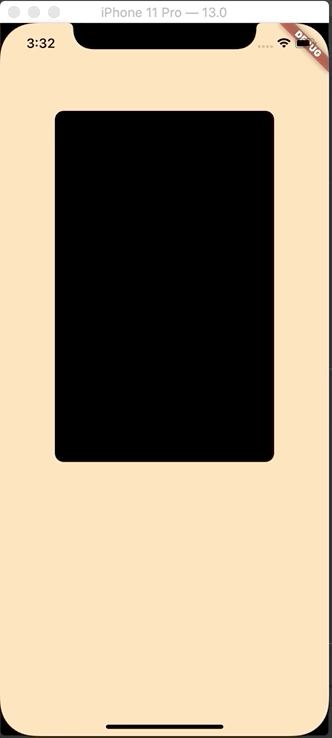

# Cards Swipe Animation

We are trying to implement this kind of Animation in one of our Flutter apps developed in the MoneyTap

## Sample:

## What do we get in this sample?

A card which changes its position with the movement of the the PageView.

## What are the Widget used?

It contains few simple widgets as follow:
* Modified PageView (https://medium.com/flutter-community/synchronising-widget-animations-with-the-scroll-of-a-pageview-in-flutter-2f3475fcffa3).
* StackView
* Positioned
* Containers.

## What is the logic behind the Animation?

Logic is pretty simple, increase and decrease the left padding to move the cards, as the pages within the page view changes.
The left padding is always computed from the percentage of the scroll of the pageView.
The Page View and the Card Container is placed within the Stack, and positioned widget is used to update the position.
